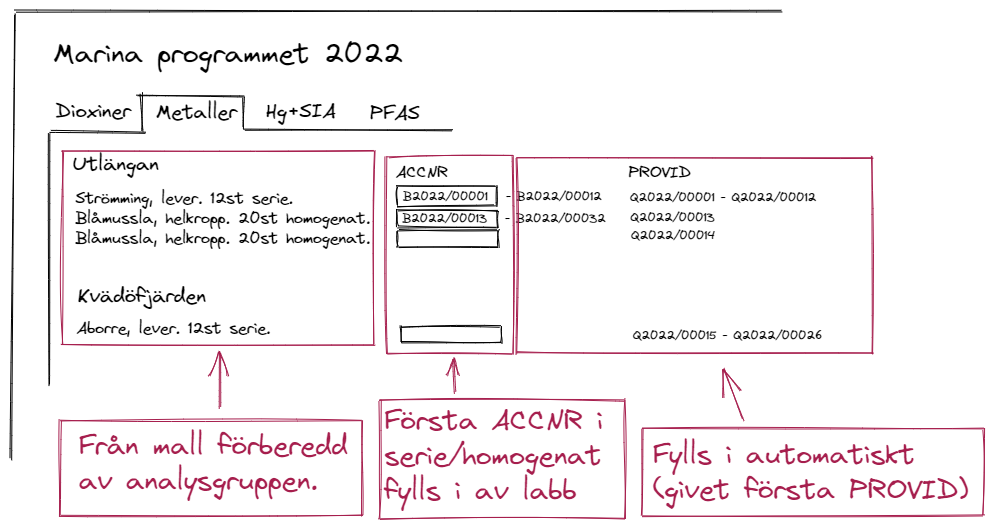

# Automatisk ifyllning av mall

Här beskriver vi närmare stegen i projekt 1.

### Anpassning av befintlig mall

Som ett första steg görs en översyn av den befintliga mallen med syfte att förbättra dess rad och kolumnstruktur. Mallen innehåller flera flikar. Dessa bör vara stukturerade så att samtliga som innehåller mätvärden går att läsa med en gemensam funktion `read_sheet(sheet_name)` utan onödiga villkorssatser. T.ex. bör värden som hör till ett visst ämne finnas i samma kolumn i alla flikar (nu ligger värden som hör till silver (AGTSI) i kolumn H i resultatfilken, i G i fliken uncertainty och E i fliken LOQ).

## Ifyllning

En stor andel av de prover som skickas för analys tillhör de två årligen återkommande projekten Marina och Limniska programmet. Mallar för dessa har väsentligen samma radstruktur varje år, det enda som skiljer i kolumnerna för provinformation är innehållet i *Accessionsnummer* och *Provnummer*. För övrigt är det t.ex. varje år ett förutbestämt antal sillar fångade vid Landsort som skall analyseras för metaller i muskelvävnad inom det Marina programmet. Inom varje "serie" (t.ex. ovanstående sillar) ligger accessions- och provnummer i nummerföljd. Det bör därför räcka att första numret i varje serie matas in, varefter verktyget genererar rader för de återstående.

### Accessionsnummer och homogenat

Ett accessionsnummer består i allmänhet av en bokstav, ett årtal och en femsiffrig kod. Till exempel B2022/01234. Ibland består dock prover av ett homogenat, det vill säga vävnad från flera individer har körts i en mixer. I Marina och Limniska programmen är individerna i ett homogenat alltid i nummerföljd. 10 mixade sillar med start B2022/01234 noteras då som accessionsnummer B2022/01234-01243. Även detta bör genereras automatiskt baserat på första accessionsnummer. 

## Inmatningsformulär

Ett exempel på hur ett inmatningsformulär kan se ut ges av nedanstående bild.

Ifyllt skulle detta kunna generera en mall motsvarande exempelmallen, samtidigt som informationen skulle sparas i en databas.

# Indata

Ovan nämnda formulär skall kunna genereras baserat på en strukturfil innehållande en tabell med kolumner

- Lokal
- Art
- Organ
- Antal prover
- Antal individer per prov

som i [template1.csv](template1.csv). I samband med inläsning av strukturfilen ges även startvärde för kolumnen PROVID samt diverse metadata (motsvarande de första två flikarna i exempelmallen).

# Lagring

Appen bör samtala med en databas i vilken inmatade uppgifter sparas efterhand (inmatningen sker typiskt under lång tid). Här bör även föreberedas plats för de rapporterade värdena.
